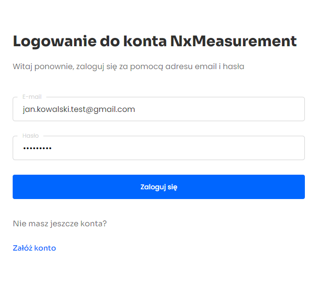

<h1 align="center">NXMeasurement</h1>

## Project Overview

The NxMeasurement application is used to create body weight measurements. In the application, you can add clients, create and analyze body weight measurements. The javascript - react library was used to build the application together with other libraries listed below.
Node.js from express.js was used to build the backend of the application. [backend repository](https://github.com/LucaMederak/nxmeasurement-backend)

## Tech used

| Tech                                               | Description                               |
| -------------------------------------------------- | ----------------------------------------- |
| [React](https://reactjs.org/)                      | Library for building user interfaces      |
| [Typescript](https://www.typescriptlang.org/)      | Javascript superset language              |
| [Styled Components](https://styled-components.com) | CSS-in-JS styling framework               |
| [Redux](https://redux.js.org/)                     | A Predictable State Container for JS Apps |
| [Formik](https://formik.org/)                      | Open source form library for React        |
| [Framer Motion](https://www.framer.com/motion/)    | Motion library for React                  |

## Live

https://nxmeasurement.vercel.app/

## Credentials

If you don't want to register, use this data:

- Email: jan.kowalski.test@gmail.com
- Password: jankowalskitest



## Installation

```bash
git clone https://github.com/LucaMederak/nxmeasurement.git
npm install
# set up environment variables
npm run start
```
